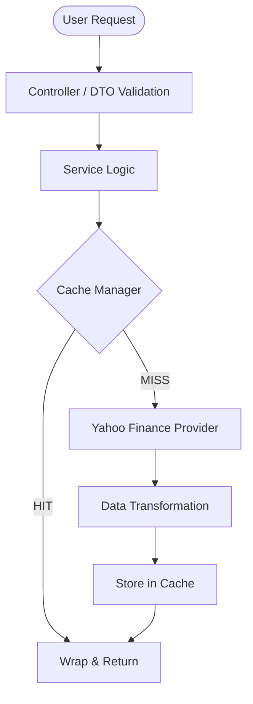

# 🏗 Project Architecture

This document describes the high-level architecture of the FetchETF service, its design principles, and how data flows through the system.

## 🏛 Core Design Principles

The project is built with **NestJS**, following a modular architecture that emphasizes separation of concerns, maintainability, and scalability.

1.  **Modularity**: Each functional area (History, Reports, Search, etc.) is isolated in its own module.
2.  **Provider Pattern**: External dependencies (like Yahoo Finance) are injected as providers to de-couple the library from the business logic.
3.  **Cross-Cutting Concerns**: Features like caching and error handling are handled globally or via decorators to keep services clean.

## 📁 System Structure

The codebase is organized into functional domains:

### 1. `src/etf` (Domain Logic)
- **Core**: Handles basic ETF metadata and real-time price quotes.
- **History**: Manages daily and intraday historical charts and dividend events.
- **Insights**: Performs technical analysis and retrieves holdings/composition data.
- **Reports**: Consolidates data from multiple services into unified master reports.
- **Search & Discover**: Handles instrument discovery and search queries.

### 2. `src/provider` (Infrastructure)
- Contains the `YAHOO_FINANCE_INSTANCE`. By using a central provider, we can configure the Yahoo Finance library once (e.g., adding proxies or retail headers) and use it everywhere.

### 3. `src/common` (Shared Utilities)
- **Constants**: Holds centralized values like `CACHE_TTLS` and labels.
- **Filters**: Includes the `HttpExceptionFilter` which catches all internal errors and maps them to clean, consistent API responses.

## 🔄 Data Flow

When a request arrives:
1.  **Controller**: Validates parameters using DTOs and routes the request to the appropriate Service.
2.  **Service (Cache Check)**: The service first checks the `CacheManager` using a unique key.
3.  **Service (Data Fetch)**: If data is missing (Miss), the service uses the `YAHOO_FINANCE_INSTANCE` to fetch live data.
4.  **Transformation**: The service wraps the raw data with metadata (like `expiresAt`) before saving it to the cache and returning it to the user.



## 🛡 Robust Error Handling

We use a Global Exception Filter located in `src/common/filters/http-exception.filter.ts`. 

- **Internal Errors**: If Yahoo Finance fails or a symbol is not found, the filter catches the exception.
- **Consistency**: It ensures the API always returns a predictable JSON structure:
  ```json
  {
    "statusCode": 404,
    "message": "Symbol not found",
    "timestamp": "2024-..."
  }
  ```

## 🚀 Deployment & Infrastructure

### 🐳 Containerization
The service is fully containerized using a **multi-stage Dockerfile**. This ensures that the production image is minimal, containing only the compiled code and production dependencies.

- **Stage 1 (Builder)**: Uses `node:20-alpine` to install all dependencies and build the TypeScript project (`dist` folder).
- **Stage 2 (Runner)**: Uses the same lightweight base image, copies only the `dist` and `package.json`, and installs only production dependencies.

### 🏗 Orchestration
We use **Docker Compose** to simplify the lifecycle of the container:
- **Build**: `docker-compose build`
- **Execution**: `docker-compose up -d`

## 🚀 Scalability
The architecture is prepared for growth:
- **Redis Ready**: The L1 in-memory cache can be swapped for a Distributed Redis cache in `AppModule` without touching any business logic.
- **Stateless Design**: Since the app is stateless (relying on cache/external API), it can be horizontally scaled using any container orchestrator (Kubernetes, AWS ECS, etc.).
